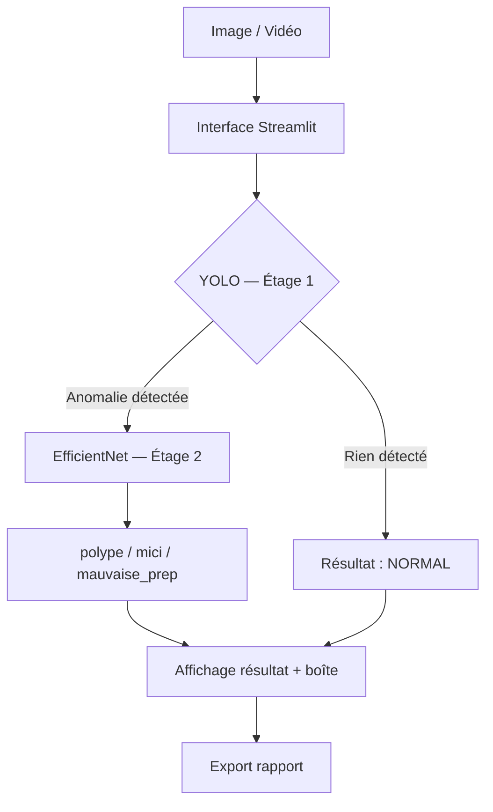

# architecture/architecture_objectif_global.mmd

## Rôle dans le projet
Schéma de l'architecture globale du système MEDET au format **Mermaid**. Ce fichier décrit visuellement le flux complet du projet, depuis l'entrée des données médicales jusqu'au résultat affiché à l'utilisateur. Il sert de référence commune pour toute l'équipe (ingénieurs, médecins, partenaires).

---

## Format Mermaid
Le fichier `.mmd` est rendu automatiquement par GitHub comme un diagramme interactif. Pas besoin de logiciel spécial pour le visualiser — il s'affiche directement dans l'interface GitHub.

**Pour modifier ou tester le diagramme :**
→ https://mermaid.live — coller le contenu et voir le rendu en direct.

---

## Ce que décrit le schéma

### Flux principal

```
Entrée
  └── Image (JPG/PNG) ou Vidéo (MP4/AVI)
           │
           ▼
    Interface utilisateur
    (Streamlit POC v1 ou v2)
           │
           ▼
    Pipeline d'inférence
    ┌──────────────────────────────┐
    │  Étage 1 — YOLO              │
    │  Détection de zone suspecte  │
    │  → Anomalie ? OUI / NON      │
    └──────────────────────────────┘
           │ OUI
           ▼
    ┌──────────────────────────────┐
    │  Étage 2 — EfficientNet      │
    │  Classification fine         │
    │  → polype / mici /           │
    │    mauvaise_prep / normal    │
    └──────────────────────────────┘
           │
           ▼
    Résultat affiché
    (classe + score de confiance
     + boîte de localisation)
```

### Composants futurs (roadmap)
```
Backend FastAPI
  └── Expose le pipeline via API REST
       └── Consommé par l'App Mobile
            └── Utilisée pendant la coloscopie
```

---

## Structure Mermaid du fichier



---

## Lien avec les autres fichiers

| Composant dans le schéma | Fichier correspondant |
|---|---|
| Interface Streamlit v1 | `poc/app.py` |
| Interface Streamlit v2 | `poc_globale/app2.py` |
| Pipeline YOLO | `notebooks/Pipeline_Hybride_...ipynb` |
| Poids YOLO | `poc/weights/yolo_polype_best.pt` |
| Poids EfficientNet | `poc/weights/efficientnet_etage2.pt` |
| Backend API (futur) | `backend/` |
| App mobile (future) | `mobile-app/` |

---

## Conventions utilisées dans le schéma
- **Rectangles** → processus / composants actifs
- **Losanges** → décisions (branchements conditionnels)
- **Flèches étiquetées** → conditions de passage (`OUI` / `NON`)
- **Couleurs** (si définies dans le fichier) → distingue les couches (entrée, traitement, sortie, futur)
